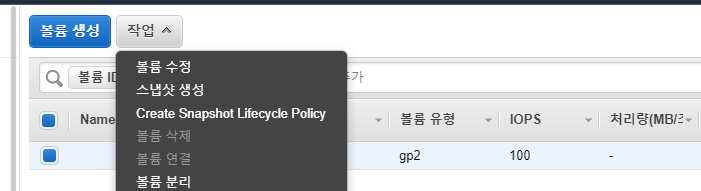

# aws ec2 용량 늘리기

## EBS 볼륨 확장
- aws console 사이트 접속 -> 서비스 -> ec2 -> 인스턴스

- 용량 늘릴 인스턴스 클릭 -> 아래 스토리지 탭 클릭 -> 볼륨 ID(아래 캡처 에서 파란색 부분) 클릭

    

- 해당 볼륨 체크 -> 위에 작업버튼 -> 볼륨 수정 클릭

    

- 늘릴 용량만큼 크기 입력후 수정 버튼 클릭

    

- 볼륨 리스트 화면에서 상태가 "optimize~" 라고 뜸 (캡처한거는 optimize 후에 캡처함)

    

- 볼륨 리스트 화면에서 상태가 in-use 라고 뜨면 완료


## 터미널 접속후 추가작업
- 파티션 확인
    ```
    $ lsblk

    NAME    MAJ:MIN RM  SIZE RO TYPE MOUNTPOINT
    ...
    xvda    202:0    0   20G  0 disk 
    └─xvda1 202:1    0    8G  0 part /
    ```

- 파티션 크기 조정
    ```
    $ sudo growpart /dev/xvda 1

    CHANGED: partition=1 start=2048 old: size=16775135 end=16777183 new: size=41940959 end=41943007
    ```

- 파일 시스템 확인
    ```
    $ df -h

    Filesystem      Size  Used Avail Use% Mounted on
    /dev/root       7.7G  7.5G  210M  98% /
    ---생략---
    ```

- 파일 시스템 확장
    ```
    $ sudo resize2fs /dev/root

    resize2fs
    Filesystem at /dev/root is mounted on /; on-line resizing required
    old_desc_blocks = 1, new_desc_blocks = 3
    The filesystem on /dev/root is now 5242619 (4k) blocks long.
    ```


## 특이사항
- 파티션 확인시 100% 일경우 에러 발생
    ```
    $ df -h

    Filesystem      Size  Used Avail Use% Mounted on
    /dev/root       7.7G  7.7G  0    100% /
    ```
    - 에러내용
        ```
        mkdir: cannot create directory ‘/tmp/growpart.1111111’: No space left on device
        FAILED: failed to make temp dir
        ```

    - 해결방법
        - 일단 최대한 공간을 만들어 본다.
            ```
            저의 경우 /var/log/journal 폴더가 800MB 차지하고 있어 로그파일 몇개 지웠습니다.
            자세한건 아래 [journal 관련 내용] 참고
            ```

        - 참고
            ```
            https://aws.amazon.com/ko/premiumsupport/knowledge-center/ebs-volume-size-increase/
            ```

        - 위에 내용 전부다 안되면 재부팅 ㄱㄱ


## journal 관련 내용
- journalctl 이란

    - systemd의 서비스 로그 확인 가능

    - systemd-journald.service에 의해서 systemd의 정보들을 분석

- journalctl 설정
    - 참고  
        https://manpages.ubuntu.com/manpages/artful/man5/journald.conf.d.5.html
    ```
    $ vi /etc/systemd/journald.conf
    [Journal]
    #Storage=auto
    #Compress=yes
    #Seal=yes
    #SplitMode=uid
    #SyncIntervalSec=5m
    #RateLimitInterval=30s
    #RateLimitBurst=1000
    #SystemMaxUse=    -> journal log 파일의 최대 Size를 지정
    #SystemKeepFree=
    #SystemMaxFileSize=
    #RuntimeMaxUse=
    #RuntimeKeepFree=
    #RuntimeMaxFileSize=
    #MaxRetentionSec=
    #MaxFileSec=1month  -> journal log 파일의 최대보관일수를 지정 ("year", "month", "week", "day", "h" or "m")

    #ForwardToSyslog=yes
    #ForwardToKMsg=no
    #ForwardToConsole=no
    #ForwardToWall=yes
    #TTYPath=/dev/console
    #MaxLevelStore=debug
    #MaxLevelSyslog=debug
    #MaxLevelKMsg=notice
    #MaxLevelConsole=info
    #MaxLevelWall=emerg
    ```

- journalctl 서비스 상태 확인
    ```
    $ sudo systemctl status systemd-journald
    ```

- journalctl 서비스 재시작
    ```
    $ sudo systemctl restart systemd-journald
    ```

- journalctl 명령어
    ```
    1. 마지막 부팅 후 로그 보기
    $ journalctl -b

    2. 오늘 날짜 로그 보기
    $ journalctl --since=today

    3. 특정 기간별 로그 보기
    $ journalctl --since "2017-05-25 00:00:00" --until "2017-05-30 10:30:00"
    $ journalctl --since "1 hour ago"
    $ journalctl --since "2 days ago"

    4. 특정 서비스 데몬 로그 보기
    $ journalctl -u sshd

    5. 특정 이벤트 속성 조회
    $ journalctl -p crit

    6. 특정 서비스데몬 및 속성과 날짜 로그 보기
    $ journalctl -u libvirtd --since=yesterday -p err

    7. Error 로그 자세히 보기
    $ journalctl -p err -o verbose

    8. 특정 이벤트 조회
    $ journalctl /sbin/crond

    9. 밑에서부터 로그 보기
    $ journalctl -f
    $ journalctl -r -b 

    10. UID 로 검색 (id)
    journalctl _UID=108
    ```
- journalctl이 느릴때(btrfs)

    ```
    1. Log의 크기를 확인
    $ journalctl --disk-usage

    2. 로그를 저장하는 파일 데이터베이스에 단편화를 확인
    $ filefrag /var/log/journal/*/*

    3. 단편화를 제거
    $ btrfs fi defrag -v -f -clzo /var/log/journal/*/* 
    ```